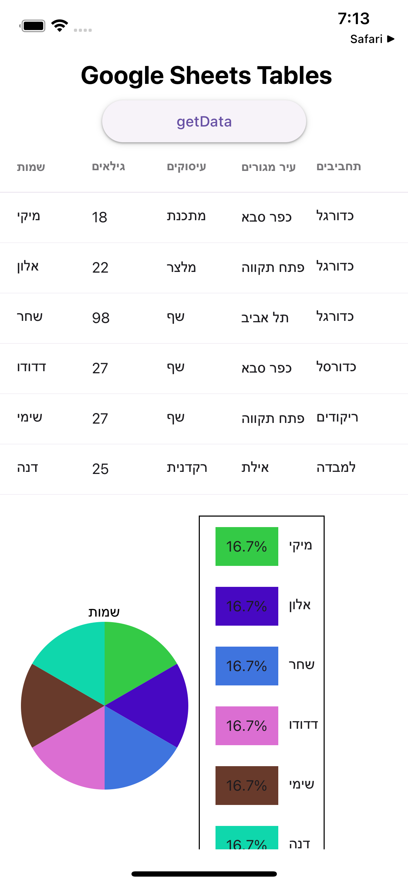

# Google Sheets Table and Pie Chart App
This app allows you to read data from a Google Sheets file and present it as both a table and a pie chart.

## Getting Started
To get started with this app, you'll need to follow these steps:

1. Clone the repository to your local machine.
2. Install the required dependencies by running npm install.
3. copy this to your terminal : cd ios && pod install && cd .. 
4. npm run ios 

## Usage
Once the app is running, you'll see a table with the data from your Google Sheets file. 
if any changes where done to the sheet mentioned below, press the button getData to get the data form the sheet

### Customization
[https://docs.google.com/spreadsheets/d/1Ug9yYtnWxvI85ZDGOHvAsC3wd25e2hz8k8rd_vEIkbo/edit#gid=0]
this is the link for the sheet to be changed. 

in the next version we will add a custom sheet. 

